# How to use Well-Plate Maker

## 1. Introduction

This tutorial explains how to use the **Well Plate Maker** package.

The Well-Plate Maker (WPM) is a shiny application deployed as an R package. 
Functions for a command-line/script use are also available. 
The WPM allows users to generate well plate maps to carry out their experiments 
while improving the handling of batch effects. 
In particular, it helps controlling the "plate effect" thanks to its ability 
to randomize samples over multiple well plates. 
The algorithm for placing the samples is inspired by the backtracking 
algorithm: the samples are placed at random while respecting specific spatial 
constraints. The use of WPM as well as the definition of configurable spatial 
constraints are described in the following sections.

### General principle

To generate plate maps, the WPM uses an algorithm inspired from the backtracking 
algorithm. More precisely, WPM loops on the following actions until all of the 
samples are given a correct location:

1. Randomly choose a well on the plate
2. Randomly selects a sample
3. Check whether all the specified location constraints are met. If yes, place the sample accordingly

This process allows for an experimental design by block randomization.

### Uses and associated input formats

There are two ways to use the `WPM`:

* Command line with appropriate R functions: for users who want to work with 
scripts or want to integrate the WPM into a pre-existing pipeline.
* Through a graphical interface (GUI): for users who do not necessarily have advanced
R programming skills.

If you finally plan to use the command line version, stop this current app and
enter `browseVignettes("wpm")` in the console: you will access the tutorial for
 the command line version.

---

| Input Format          | Command line | WPM app |
| --------------------- |:------------:| :------:|
| CSV                   | yes          | yes     |
| ExpressionSet         | yes          | no      |
| SummarizedExperiment  | yes          | no      |
| MSnSet                | yes          | no      |

## 2. How to use the WPM shiny application

The WPM supports multiple plates and places samples in a balanced way among the plates.

The WPM has 4 main panels: __Home__, __Parameters__, __Results__ and __Help__.
The __Home__ tab briefly presents the aim of the app, shows the last package version, 
explains how to support our work by citing the associated article and gives contact information.
The __Help__ tab is this current tab.

---

## 3. The Parameters tab

Overall the page is organized in two sections.

The one on the left hand side contains all the configuration steps. 
It is divided into 7 main steps, detailed below. It is of the utmost 
importance to correctly specify all the constraints for generating the desired 
plate maps.

The one on the right hand side summarizes the input parameters (tuned along the 7 steps of
the left panel) as well as the chosen (empty) plate layout. The right section is 
automatically updated each time a parameter is changed in the left section.

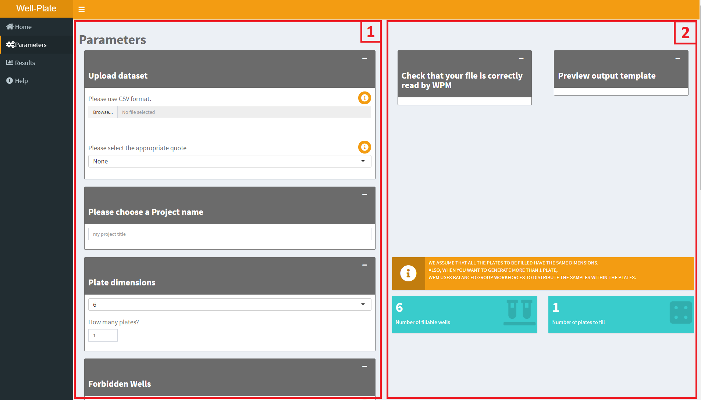

---

### 3.1 Step 1: Upload the dataset

First, you need to upload a *__Comma-separated values__* (.CSV) or a text (.txt) file. 
This file contains at least one piece of information: the list of the sample names.

| Sample |
|--------|
| s1     |
| s2     |
| s3     |
| s4     |

It is also possible to provide a file containing several other variables describing
the data, as in the example below:

| Sample | Type | Treatment | ... |
|--------|------|-----------|-----|
| s1     | A    | trt1      | ... |
| s2     | A    | trt1      | ... |
| s3     | B    | Ctrl      | ... |
| s4     | C    | Ctrl      | ... |

__IMPORTANT__ Please make sure the data in the CSV file respect the following SPECIFIC ORDER of columns:
Sample names in the __first__ column, and other variables in the other columns, 
like the example below (if there are rownames, then the *Samples* Column must be 
the second in the file.):

    Sample;Type;Treatment
    s1;A;trt1
    s2;A;trt1
    s3;B;Ctrl
    s4;C;Ctrl

> If this is your first time using the WPM, we recommend that you test the 
capabilities of the WPM using the **demo dataset** ("Load the demo dataset" tab).

Second, you have to specify if there are quotes in your file or not
*(If you are using the demo dataset, this is not a requested parameter.)*:

The default is *none*, meaning that there is no __*"*__ or __*'*__ characters in your file.
If you select the appropriate quote, then you will be able to:

* check if your file does have a __header__ and __row names__.
* select the appropriate __separator__ field. Default is semicolon (__*";"*__)

Then, you can select one of the variables that you want to use as the grouping
factor for WPM.  
This column will be renamed "Group" in the final dataset.

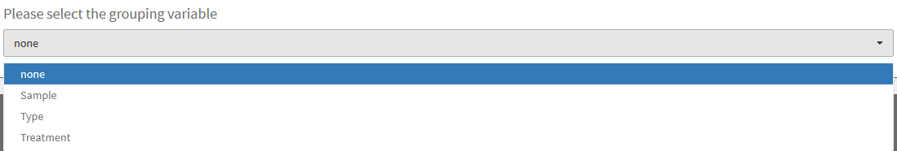

The names you give to columns in your CSV file do not matter, because the WPM will create
a new dataset having 3 fields: _"Sample"_ , _"Group"_ and _"ID"_.

You will see your dataset on the right hand side of the window, as well as another dataset 
which will be used by WPM to generate the map(s).   
Each sample is assigned a unique ID, which will be used to name it
onto the plate maps (for more details on the ID see the [Results section](#results_panel) ).

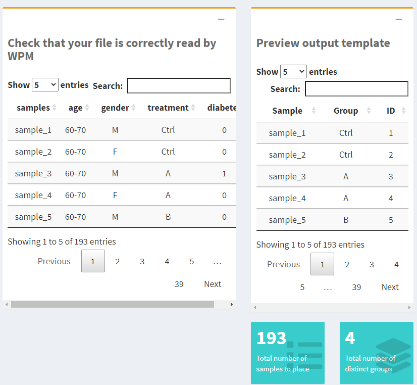

__IMPORTANT__ Please ensure that the dataset is correctly displayed in the right
window and that the number of samples / groups is correct.    
If you see that the total number of samples is wrong, this means that you have
not chosen the appropriate options among those described above, so that corrections are needed.

---

### 3.2 Step 2: Choose a Project name
This step is mandatory. It will be used in the plot titles as well as in the output 
file names. Moreover, it be concatenated with sample IDs to limit confusions.

---

### 3.3 Step 3:  Plate(s) dimensions

Here you have to specify the plate dimensions and their number. Currently, WPM 
supports plate dimensions of 6, 24, 48, 96, 386, 1534 wells;  as well as custom dimensions 
(where you manually specify the number of rows and columns).

To the right of step 2 you can see an information box, warning you that WPM 
will distribute the samples in a balanced manner within the plates (if there 
are several of them).

If you select a plate size compatible with the total number of samples, you 
will see two blue boxes and a plate plan appear on the right hand side. They summarize all 
the elements of your configuration.
In the example below, we selected the pre-defined dimension of 96 wells and only
one plate:

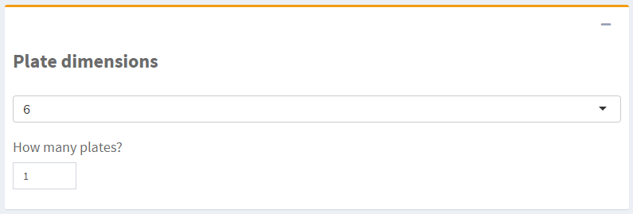

The right side of the panel will summarize all these parameters:

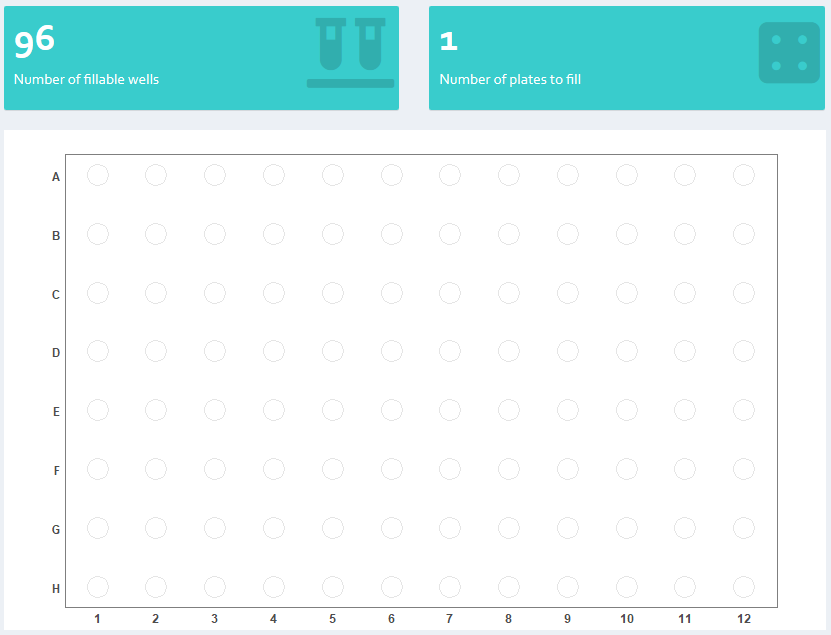

This plot updates with each modification of the parameters, thus making it 
possible to see if one has made an error.

__IMPORTANT__: If the WPM detects a problem or incompatibility between parameters, 
you will see an error message instead of the plate map, providing hints on the possible origin of the problem.

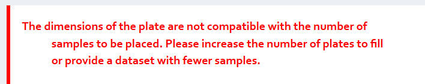

---

### 3.4  Step 4: Forbidden wells

In this step are listed the __Forbidden wells__, if any (optional):

> A __Forbidden well__ will not be filled with any kind of sample, either 
because the user does not want to (*e.g.* plate corners in case of non-uniform
heat distribution), or because of material constraints (*e.g.* dirty wells, broken
pipettes).

You fill the text input with the coordinates of the wells (a combination of 
letters and numbers, as in the example below):

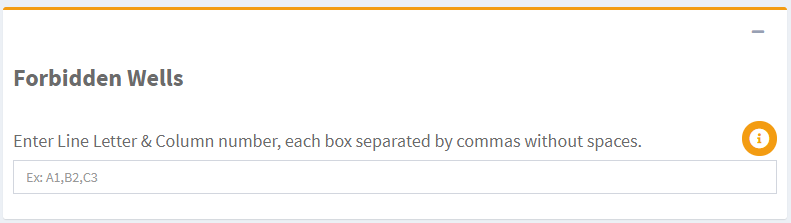

You will see the plot updated in the right section:

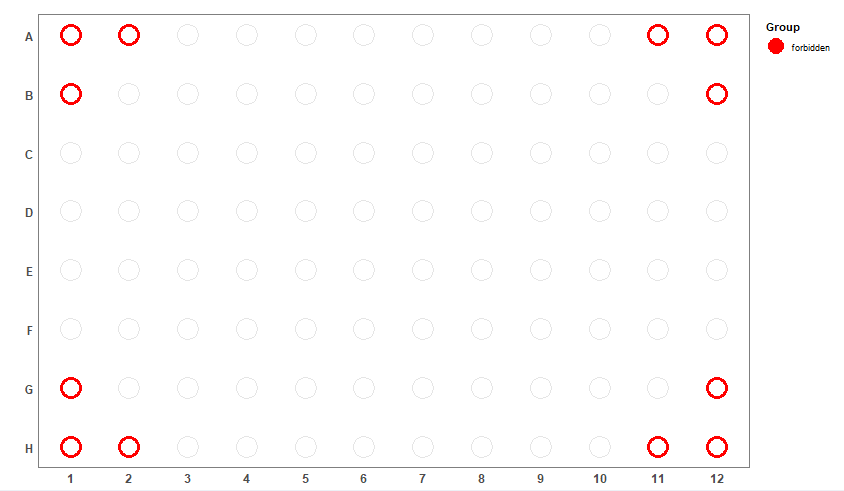

The wells filled with forbidden wells will have the *"forbidden"* ID in the 
final dataset. On the resulting map, these wells will be colored in red.

---

### 3.5 Step 5: Buffers
At this stage you can specify the wells which correspond to buffers, if there
are any.

> A __buffer well__ corresponds to a well filled filled with solution but 
without biological material (*e.g.* to avoid/check for cross-contamination).

Five patterns are available for placing the buffers:

**1)** *no buffers*: there will be no buffer on the plate(s).

**2)** *Per line*: Automatically places buffers every other row. 
You can choose to start placing in even or odd row.

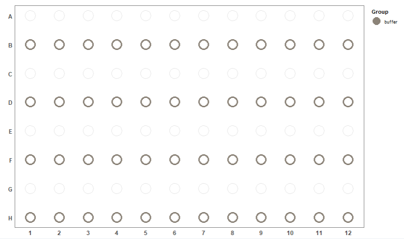

**3)** *Per column*: Automatically places buffers every other column. 
You can choose to start placing in even or odd column.

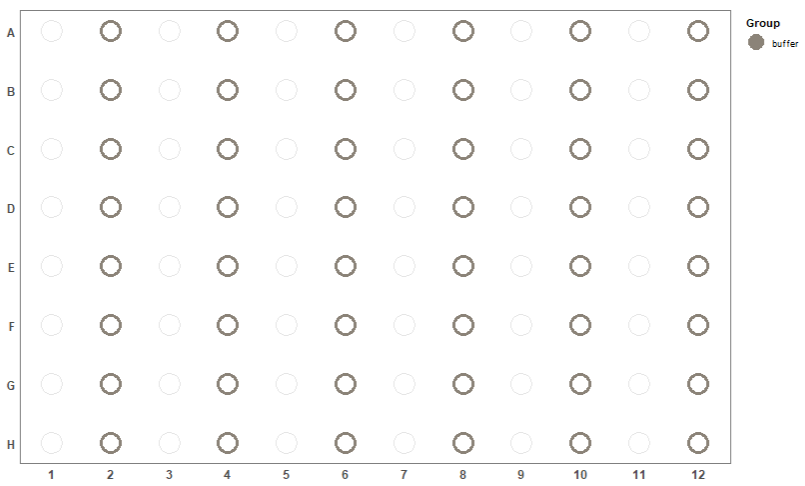

**4)** *Checkerboard*: Automatically places buffers like a checkerboard.

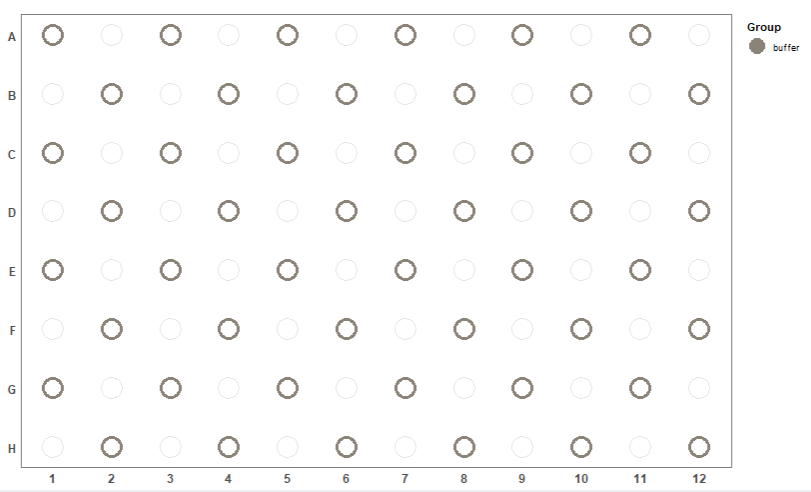

**5)** *Choose by hand*: It is the same procedure as for specifying forbidden 
wells.

The wells filled with buffer solution will have the *"buffer"* ID in the 
final dataset. On the resulting map, these wells will be colored in grey.

---

#### Specify the neighborhood constraints

These are the spatial constraints that the WPM needs to respect when designing the plates.
Currently, 4 types of them are proposed. Note that the patterns are available only 
if they are compatible with the chosen buffer pattern.
The question here is: Should samples from the same group be found side by side?

Schematically, the spatial constraints can be summarized as follows (the blue
well is the current well evaluated by WPM; The wells in green are those 
assessed for compliance with the chosen constraint. The blue well therefore has 
the possibility (but not the obligation since the filling of the plate is done 
randomly) to be filled with a sample belonging to the same group as the samples 
in the wells evaluated.

NS (North South): samples from the same group will not be placed side by side 
column-wise.

WE (West East): samples from the same group will not be placed side by side 
row-wise.

NSEW (North South East West): samples from the same group will not be placed 
side by side either row-wise or column-wise.

None: samples from the same group can be placed anywhere, including side by side.

---

### 3.6 Step 6: Fixed samples

At this stage you can specify the wells which correspond to fixed 
samples, if there are any. 

> A __fixed sample__ corresponds to a quality control sample or standard.
The precise location of these samples must be controlled by the researcher.

This step works in exactly the same way as the 
[forbidden well](#forbidden_wells) step. The only difference is that the fixed samples
will appear in **black** on the plot.

The fixed samples will have the *"fixed"* ID in 
the final dataset.

---

### 3.7 Step 7: Number of iterations

Choose a **maximum number of iterations** to find a solution, then start the 
WPM by clicking the **"start WPM"** button. If the samples do not have a group, then the samples 
will be placed completely randomly on the plates. If there are groups, the WPM will 
use an algorithm inspired by the backtracking algorithm (to place the 
samples in the wells while respecting the specified constraints).

The default value is 20, but if your configuration is somewhat complex, then 
it is advised to increase the number.

An *iteration* corresponds to an attempt by the WPM to find a solution. The 
algorithm used is not fully backtracked: the WPM stops as soon as there are no 
more possibilities to finalize the current solution; then, it starts back from scratch 
the plate map, until a solution that fits all the constraints is found.
With this approach, not all possible combinations are explored, but it does 
reduce execution time.

When you start the computations, a progress bar appears.

If the WPM finds a solution, you will see this pop in the browser, inviting you to 
go to the [Result Panel](#results_panel):

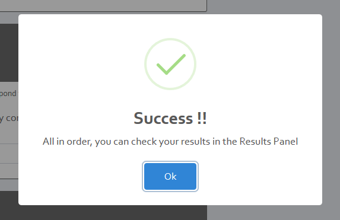

If the WPM fails, an error message will appear, prompting you to try again: 

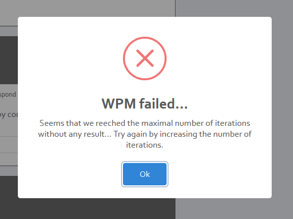

__IMPORTANT__ If after launching WPM and generating the results, you realize 
that one or more parameters do not work, you can always return to the 
"Parameters" tab and modify them. The data displayed in the "Results" tab will 
not be automatically changed, you will have to click again on the "start WPM" 
button to take into account the new changes.

__NOTE__ If you want to create a new plate plan for another project, press 
`ctrl + f5`, this will reset the application.

---

## 4. Results tab

The Result panel allows you to look at the final dataset containing the well 
chosen for each sample, as well as a plot of your final well-plate map. Dataframe and 
plots are downloadable separately.

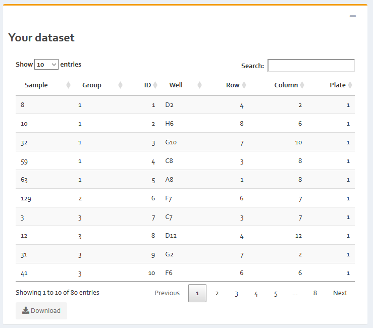

The dataset contains 7 columns giving all the information needed to implement the 
experiment: The sample name with its corresponding group; its ID for the plot; 
the well chosen; the row and the column to which the well corresponds to; and the 
number of the plate on which the sample must be placed.

This tab also shows the generated plot(s) of the final well-plate map(s).
One color corresponds to one group label. The numbers are the IDs used in 
place of the sample names which could be too long to keep the plot readable.

Below is an example of 80 samples distributed in 10 groups (of unequal sizes) and placed on a 
96 well-plate, with the North-South-East-West neighborhood constraint:

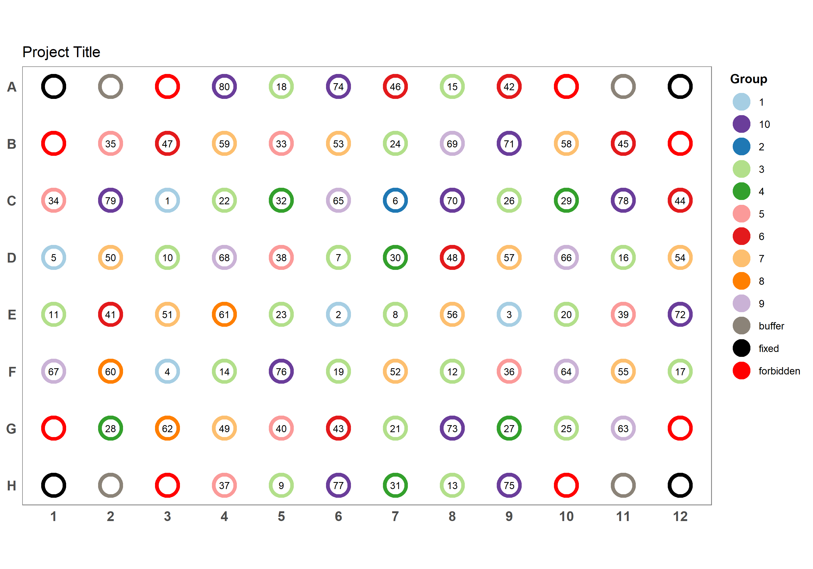

