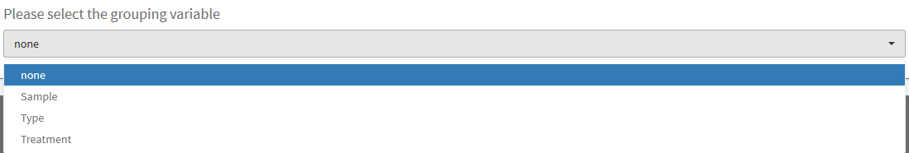
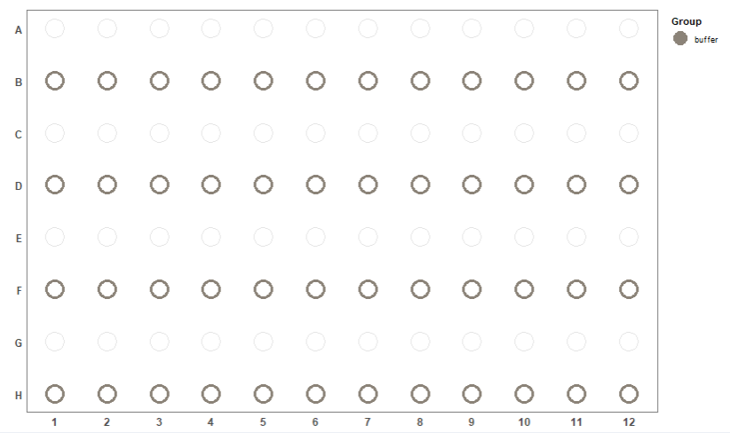
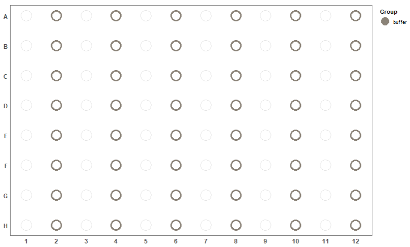
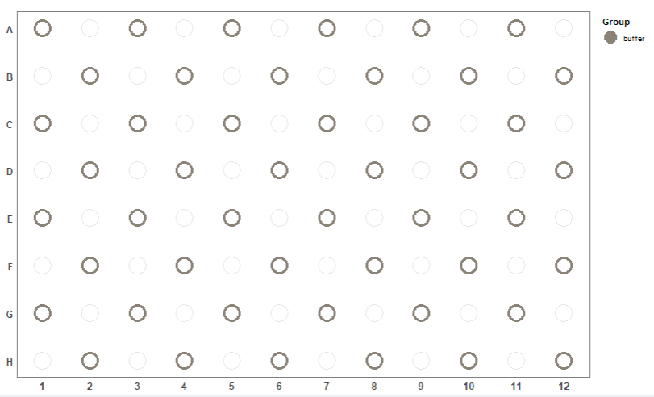

# How to use Well-Plate Maker

## 1. Introduction

To generate plate maps, WPM uses an algorithm inspired from the backtracking
algorithm. In other words, WPM will gradually fill the plate by randomly
traversing it. At each well chosen (randomly), WPM will randomly choose a
sample which satisfies all the constraints specified during the configuration
step.

There are two ways using the `wpm` package:

* through a shiny application for users who don't have any skill in R
programming.
* using R commands for users who want to work with their own R scripts.

If you finally plan to use the command line version, stop this current app and
enter `browseVignettes("wpm")` in the console: you will access the tutorial for
 the command line version.

---

## 2. Supported input formats

| Input Format          | Command line | WPM app |
| --------------------- |:------------:| :------:|
| CSV                   | yes          | yes     |
| ExpressionSet         | yes          | no      |
| SummarizedExperiment  | yes          | no      |
| MSnSet                | yes          | no      |

Since WPM proposes a GUI, the idea is to just provide a minimum of parameters
to the application. No programming skills are required. WPM supports multiple
plates and places samples in a balanced way among the plates.

WPM has 4 main tabs: __Home__, __Parameters__, __Results__ and __Help__.
The __Home__ tab briefly presents the aim of the app, shows the last package version,
explains how to cite us to support our work and gives the contact information.
The __Help__ tab is this current tab.

---

## 3. Parameters tab

Overall the page is organized in two sections. The one on the left contains all
the configuration steps.  
The one on the right summarizes the parameters entered
as well as the plate plan which will be used by WPM.  
The right section is
automatically updated each time a parameter is changed in the left section.

The section 1 is divided into 6 main steps, detailed below. This part is the
most important to understand and master because it is here that we will
specify all the constraints for generating the desired plate maps.

---

### 3.1 Upload dataset

First, you must upload the CSV file. This file contains at least one kind of
information: the sample names.
| Sample |
|--------|
| s1     |
| s2     |
| s3     |
| s4     |

It is also possible to provide a CSV containing several variables describing
the data as in the example below:

| Sample | Type | Treatment | ... |
|--------|------|-----------|-----|
| s1     | A    | trt1      | ... |
| s2     | A    | trt1      | ... |
| s3     | B    | Ctrl      | ... |
| s4     | C    | Ctrl      | ... |

__IMPORTANT__ Please respect this ORDER of columns for the data in the CSV file:
Sample names in the __first__ column, and other variables in the other columns.

Second, you have to specify if there are quotes in your file or not. 
The Default is none, meaning that there is no __*"*__ or __*'*__ characters in your file.
If you select the appropriate quote, then you will be able to check these 
parameters:

* check if your file does have a __header__ and __row names__.
* select the appropriate __separator__ field. Default is semicolon (__*";"*__)

Then you can select one of the variables that you want to use as the grouping
factor for WPM.  
This column will be renamed "Group" in the final dataset.

The names you give to columns in your CSV do not matter, because WPM will create
a new dataset having 3 fields: _"Sample"_ , _"Group"_ and _"ID"_.

You will see your dataset on the right side of the window, and another dataset 
which will be used by WPM to generate the map(s).   
Each sample is assigned a unique ID, which will be used to assign the samples
to plate maps (for more details on the ID see the
[Results section](#results) ).

__IMPORTANT__ Please ensure that the dataset is correctly
displayed in the right window and that the number of samples / groups is
correct.  
If you see that the total number of samples is wrong, this means that you have
not chosen the appropriate options among those described above and you need to
set the correct ones.

---

### 3.2 Choose a Project name
This step is optional. If you provide one, it will be used in the plots titles
and in the name of the final dataset.

---

### 3.3 Plate(s) dimensions

Here you have to specify the plate dimensions and their number. Currently, WPM
supports plate dimensions of 6,24, 48, 96, 386, 1534 wells and a custom option
(where you specify the number of lines and columns by hand).

To the right of step 2 you can see an information box, warning you that WPM
will distribute the samples in a balanced manner within the plates (if there
are several).

If you select a plate size compatible with the total number of samples, you
will see two blues boxes and a plate plan appear on the right summarizing all
of your configuration.  
In the example below, we selected the pre-defined dimension of 96 wells and only
one plate:

The right side of the tab will summarize all these parameters:

This plot updates with each modification of the parameters, thus making it
possible to see if one has made an error.

__IMPORTANT__: If WPM detects a problem or incompatibility between parameters,
you will see an error message instead of the plate map, explaining you what
could be the problem.

---

### 3.4 Forbidden wells

In this step are listed the __Forbidden wells__ if any (this is optional of
course):

> A __Forbidden well__ will not be filled with any kind of sample.
We simply do not want to fill them (*e.g.* the coins of the plate), or in
case of dirty wells, broken pipettes, etc.

You fill the text input with a combination of letters and numbers like in the
example below:

You will see the plot updated in the right section:

The wells filled with forbidden wells will have the *"forbidden"* ID in the
final dataset.

---

### 3.5 Buffers
At this stage you can specify the wells which correspond to buffers, if there
are any.

> A __buffer well__ corresponds to wells filled in with solution but without
biological material (*e.g.* to avoid cross-contamination).

#### 3.5.1 Different possible patterns

Five patterns are available for placing the buffers:

**1)** *no buffers*: there will be no buffer on the plate(s).

**2)** *Per line*: Automatically places buffers every other line.  
You can choose to start placing in even or odd line.

**3)** *Per column*: Automatically places buffers every other column.  
You can choose to start placing in even or odd column.

**4)** *Checkerboard*: Automatically places buffers like a checkerboard.

**5)** *Choose by hand*: It is the same procedure as for specifying forbidden
wells.

The wells filled with buffer solution will have the *"buffer"* ID in the
final dataset.

---

#### 3.5.2 Specify the neighborhood constraints

These are the spatial constraints that WPM needs to create the plates.  
Currently, there are 4 types proposed. Note that the patterns are available only
if they are compatible with the chosen buffer pattern.  
The question here is: Should samples from the same group be found side by side?

Schematically, the spatial constraints can be summarized as follows (the blue
well is the current well evaluated by WPM; The wells in green are those
assessed for compliance with the chosen constraint.  
The blue well therefore has the possibility (but not the obligation since the
filling of the plate is done randomly) to be filled with a sample belonging to
the same group as the samples in the wells evaluated.

**No constraint**

**North-South constraint**

**East-West constraint**

**North-South-East-West constraint**

---

### 3.6 Fixed wells

At this stage you can specify the wells which correspond to fixed
wells, if there are any.

> A __fixed well__ corresponds to quality control samples or standards,
the precise location of which must be controlled by the experimenter.

This step works in exactly the same way as the
[forbidden well](#forbiddenWells) step. The only difference is that the fixed 
    wells will appear in **black**. on the plot.

The wells filled with fixed wells will have the *"fixed"* ID in
the final dataset.

---

### 3.7 Number of iterations

Here you choose a maximum number of iterations that WPM can do to find a
solution, then start WPM by clicking the **"start WPM"** button.  
The default value is 20, but if your configuration is somewhat complex, then
it is advisable to increase this number.  
An *iteration* corresponds to an attempt by WPM to find a solution. The
algorithm used is not a "full" backtracking: WPM stops as soon as there are no  
more possibilities to finalize the current solution, and starts from scratch
the plate map, until providing a solution that complements all the constraints.  
With this approach, not all possible combinations are explored, but it does
reduce execution time.  
A more "complete" version of backtracking could possibly
be an improvement to bring in the future.

When you start WPM, a progress bar shows which iteration WPM is at.

If WPM finds a solution, you will see this pop in the browser, inviting you to
go to the [Result tab](#results):

If WPM fails, an error message will appear, prompting you to try again:

__IMPORTANT__ If you want to create a new plate plan for another project,
press `ctrl + f5`, this will reset the application.

---

## 4. Results tab

This tab allows you to look after the final dataset containing the wells
chosen for each sample:

The dataset contains 7 columns giving all the information needed to run the
experiment: The sample name with its corresponding group; its ID for the plot;
the well chosen; the row and the column to which the well corresponds and the
number of the plate on which the sample must be placed during the experiment.

This tab also shows you the generated plot(s) of your final well-plate map(s).
One color corresponds to one group level. The numbers are the IDs used in
place of the sample names which could be too long and make the plot unreadable.

Below is an example of 80 samples distributed in 10 groups and placed on a
96 well-plate, with the North-South-East-West neighborhood constraint:

Dataset and plots are downloadable separately.
