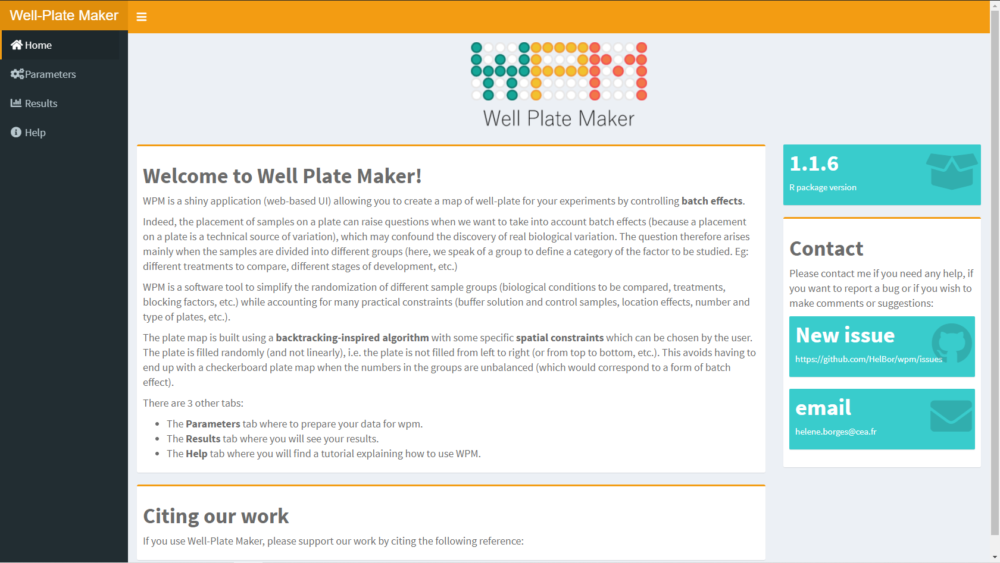

# Introduction

To generate plate maps, WPM uses an algorithm inspired from the backtracking 
algorithm. In other words, WPM will gradually fill the plate by randomly 
traversing it. At each well chosen (randomly), WPM will randomly choose a 
sample which satisfies all the constraints specified during the configuration 
step.


There are two ways using the `wpm` package:

* through a [shiny application](#shiny_app) for users who don't have any skill in R 
programming.
* using [R commands](#R_commands) for users who want to work with their own R scripts. 

__Important:__ Even if you plan to use WPM only from the command line, we 
strongly recommend the user to read the section about the 
[shiny app section](#shiny_app), as this is where all terms and concepts are 
explained in detail.


## Supported input formats

| Input Format          | Command line | WPM app |
| --------------------- |:------------:| :------:|
| CSV                   | yes          | yes     |
| ExpressionSet         | yes          | no      |
| SummarizedExperiment  | yes          | no      |
| MSnSet                | yes          | no      |


# Getting started

## Prerequisites

This tutorial explains how to use the Well Plate Maker package.
Make sure you are using the R 4.0.0 version.
Also, check that you have these packages installed (with their dependencies):
`r CRANpkg("shiny")`, `r CRANpkg("shinydashboard")`, `r CRANpkg("shinyWidgets")`
, `r CRANpkg("shinycustomloader")`, `r CRANpkg("DT")`,
`r CRANpkg("RColorBrewer")`, `r CRANpkg("logging")`, `r CRANpkg("dplyr")`, 
`r CRANpkg("stringr")`, `r CRANpkg("ggplot2")`

## Installation

From __BioConductor__:
```{r install from BioConductor, eval=FALSE}
if (!requireNamespace("BiocManager", quietly = TRUE))
    install.packages("BiocManager")

BiocManager::install("wpm")
```

# How to use the WPM shiny application {#shiny_app}

Since WPM proposes a GUI, the idea is to just provide a minimum of parameters 
to the application. No programming skills are required. WPM supports multiple 
plates and places samples in a balanced way among the plates.

## Launch the shiny application

Whether you use RStudio or simply work with an R console, the procedure remains 
the same to launch the shiny app:

```{r launch wpm, eval = FALSE}
library(wpm)
wpm()
```
If everything is in order, a new window will open in your default browser.
If not, find a line written in the R console (eg. 
`Listening on http://127.0.0.1:4028`), and paste the URL in your web browser.

WPM has 3 main tabs: __Home__, __Parameters__ and __Results__.

## The __Home__ tab

Briefly presents the aim of the app, shows the last package version, 
explains how to cite us to support our work and gives the contact information.



## The __Parameters__ tab

Overall the page is organized in two sections. The one on the left contains all 
the configuration steps. The one on the right summarizes the parameters entered 
as well as the plate plan which will be used by WPM. The right section is 
automatically updated each time a parameter is changed in the left section.


The section 1 is divided into 6 main steps, detailed below. This part is the 
most important to understand and master because it is here that we will 
specify all the constraints for generating the desired plate maps.


### Upload dataset
Before uploading the CSV file, these 3 next sub-steps are important:

* check if your file does have a __header__ and __row names__.
* select the right type of __quotes__. Default is none, meaning that there is 
no __*"*__ or __*'*__ characters in your file.
* select the appropriate __separator__ field. Default is semicolon (__*";"*__)

Then you must provide a __CSV__ file containing at least one kind of 
information: the sample names.
```{r, echo=FALSE}
knitr::kable(data.frame("Sample" = c("s1","s2","s3","s4")))
```
But if there are different variables available in the CSV file describing the 
data, you can select one of them that you want to use as the grouping factor for
WPM. This column will be renamed "Group" in the final dataset.
```{r, echo=FALSE}
knitr::kable(
    data.frame("Sample" = c("s1","s2","s3","s4"), "Type" = c("A","A","B","C"),
               "Treatment" = c("trt1","tr1","Ctrl","Ctrl"))
)
```

__IMPORTANT__ Please respect this ORDER of columns for the data in the CSV file:
Sample names in the __first__ column, and other variables in the other columns.

The names you give to columns in your CSV do not matter, because WPM will change
them into _"Sample"_ and _"Group"_.

You will see your dataset on the right side of the window, with a new column 
added: "ID".
Each sample is assigned a unique ID, which will be used to assign the samples 
to plate maps (for more details on the ID see the 
[Results section](#results_panel) ).


__IMPORTANT__ Be careful and please ensure that the dataset is correctly 
displayed in the right window and that the number of samples / groups is 
correct.
If you see that the total number of samples is wrong, this 
means that you have not chosen the appropriate options among those described 
above and you need to set the correct ones.

### Choose a Project name
This step is optional. If you provide one, it will be used in the plots titles 
and in the name of the final dataset.


### Plate(s) dimensions {#plate-dims}

Here you have to specify the plate dimensions and their number. Currently, WPM 
supports plate dimensions of 6,24, 48, 96, 386, 1534 wells and a custom option 
(where you specify the number of lines and columns by hand).

To the right of step 2 you can see an information box, warning you that WPM 
will distribute the samples in a balanced manner within the plates (if there 
are several).


If you select a plate size compatible with the total number of samples, you 
will see two blues boxes and a plate plan appear on the right summarizing all 
of your configuration.
In the example below, we selected the pre-defined dimension of 96 wells and only
one plate:


The right side of the panel will summarize all these parameters:


This plot updates with each modification of the parameters, thus making it 
possible to see if one has made an error.

__IMPORTANT__: If WPM detects a problem or incompatibility between parameters, 
you will see an error message instead of the plate map, explaining you what 
could be the problem.


### Forbidden wells {#forbidden_wells}

In this step are listed the __Forbidden wells__ if any (this is optional of 
course): 

> A __Forbidden well__ will not be filled with any kind of sample. 
We simply do not want to fill them (*e.g.* the coins of the plate), or in 
case of dirty wells, broken pipettes, etc.

You fill the text input with a combination of letters and numbers like in the 
example below:


You will see the plot updated in the right section:


The wells filled with forbidden wells will have the *"forbidden"* ID in the 
final dataset.


### Blanks {#blanks}
At this stage you can specify the wells which correspond to blanks, if there 
are any. 

> A __Blank well__ corresponds to wells filled in with solution but without 
biological material (*e.g.* to avoid cross-contamination).

Five patterns are available for placing the blanks:

**1)** *no blanks*: there will be no blank on the plate(s).

**2)** *Per line*: Automatically places blanks every other line. 
You can choose to start placing in even or odd line.


**3)** *Per column*: Automatically places blanks every other column. 
You can choose to start placing in even or odd column.


**4)** *Checkerboard*: Automatically places blanks like a checkerboard.


**5)** *Choose by hand*: It is the same procedure as for specifying forbidden 
wells.

#### Specify the neighborhood constraints {#neighborhood}

These are the spatial constraints that WPM needs to create the plates.
Currently, there are 4 types proposed. Note that the patterns are available only 
if they are compatible with the chosen blank pattern.
The question here is: Should samples from the same group be found side by side?

Schematically, the spatial constraints can be summarized as follows (the blue
well is the current well evaluated by WPM; The wells in green are those 
assessed for compliance with the chosen constraint. The blue well therefore has 
the possibility (but not the obligation since the filling of the plate is done 
randomly) to be filled with a sample belonging to the same group as the samples 
in the wells evaluated.

{width=50%}

{width=50%} 

{width=50%}

{width=50%}

The wells filled with blank wells will have the *"blank"* ID in the 
final dataset.

### Not Randomized wells {#notRandom_wells}

At this stage you can specify the wells which correspond to not randomized 
wells, if there are any. 

> A __Not Randomized well__ corresponds to quality control samples or standards,
the precise location of which must be controlled by the experimenter.

This step works in exactly the same way as the 
[forbidden well](#forbidden_wells) step. The only difference is that the not 
randomized will appear in **black** on the plot.

The wells filled with not randomized wells will have the *"notRandom"* ID in 
the final dataset.

### Number of iterations

Here you choose a maximum number of iterations that WPM can do to find a 
solution, then start WPM by clincking the **"start WPM"** button. 
The default value is 20, but if your configuration is somewhat complex, then 
it is advisable to increase this number.
An *iteration* corresponds to an attempt by WPM to find a solution. The 
algorithm used is not a "full" backtracking: WPM stops as soon as there are no 
more possibilities to finalize the current solution, and starts from scratch 
the plate map, until providing a solution that complements all the constraints.
With this approach, not all possible combinations are explored, but it does 
reduce execution time. A more "complete" version of backtracking could possibly 
be an improvement to bring in the future.

When you start WPM, a progress bar shows which iteration WPM is at.

If WPM finds a solution, you will see this pop in the browser, inviting you to 
go to the [Result Panel](#results_panel):


If WPM fails, an error message will appear, prompting you to try again: 


__IMPORTANT__ If you want to create a new plate plan for another project, 
press `ctrl + f5`, this will reset the application.

## The __Results__ tab {#results_panel}

This tab allows you to look after the final dataset containing the wells 
chosen for each sample:


The dataset contains 7 columns giving all the information needed to run the 
experiment: The sample name with its corresponding group; its ID for the plot; 
the well chosen; the row and the column to which the well corresponds and the 
number of the plate on which the sample must be placed during the experiment.

This tab also shows you the generated plot(s) of your final well-plate map(s).
One color corresponds to one group level. The numbers are the IDs used in 
place of the sample names which could be too long and make the plot unreadable.

Below is an example of 80 samples distributed in 10 groups and placed on a 
96 well-plate, with the North-South-East-West neighborhood constraint:


Dataset and plots are downloadable separately.

# How to use WPM using command lines {#R_commands}

As explained before, WPM can also be used through R command lines by following these steps:

1. Create the dataset for WPM
2. Run WPM
3. Visualize the final plate plan(s)

## Prepare the dataset
The user can work with CSV files, `ExpressionSet`, `MSnSet` or 
`SummarizedExperiment`objects.
The first step is to create a dataframe containing all the data needed by wpm 
to work properly. To do so:

### Starting from a CSV file, then run:
```{r convert CSV file, eval = FALSE}
df <- wpm::convertCSV("path-to-CSV-file")
```
### Starting from an `ExpressionSet` or `MSnSet` object
```{r create an MSnSet object}
sample_names <- c("s1","s2","s3","s4", "s5")
M <- matrix(NA, nrow = 4, ncol = 5)
colnames(M) <- sample_names
rownames(M) <- paste0("id", LETTERS[1:4])
pd <- data.frame(Environment = rep_len(LETTERS[1:3], 5),
                 Category = rep_len(1:2, 5), row.names = sample_names)
rownames(pd) <- colnames(M)
my_MSnSet_object <- MSnbase::MSnSet(exprs = M,pData =  pd)
```

then run `convertESet` by specifying the object and the variable to use as 
grouping factor for samples:
```{r convert ESet/MSnSet object}
df <- wpm::convertESet(my_MSnSet_object, "Environment")
```

### Starting from a `SummarizedExperiment`

```{r convert SummarizedExperiment object}
nrows <- 200
ncols <- 6
counts <- matrix(runif(nrows * ncols, 1, 1e4), nrows)
colData <- data.frame(Treatment=rep(c("ChIP", "Input"), 3),
                      row.names=LETTERS[1:6])
se <- SummarizedExperiment::SummarizedExperiment(assays=list(counts=counts),
                                                 colData=colData)
df <- wpm::convertSE(se, "Treatment")
```

## Run WPM

The next step is to run the wpm wrapper function by giving it all the parameters
needed. For more details on the parameters, please see the sections about
[plate dimensions](#plate-dims), [forbidden wells](#forbidden_wells), 
[Blanks](#blanks), [Quality Control wells](#notRandom_wells) and 
[Spatial constraints](#neighborhood).

In this toy example, we do not specify any blank well.

```{r run wpm}
wpm_result <- wpm::wrapperWPM(user_df = df,
            plate_dims = list(8,12),
            nb_plates = 1,
            forbidden_wells = "A1,A2,A3",
            QC_wells = "B1,B2",
            spatial_constraint = "NS")
```

## Plate map visualization
The last step is to plot the plate map(s) using:
```{r visualize plate map}
drawned_map <- wpm::drawMap(df = wpm_result,
        sample_gps = length(levels(as.factor(pd$Environment))),
        gp_levels = gp_lvl <- levels(as.factor(pd$Environment)),
        plate_lines = 8,
        plate_cols = 12,
        project_title = "my Project Title")
```

```{r see the map}
drawned_map
```


Plots can be saved with:
```{r save map plot, eval=FALSE}
ggplot2::ggsave(
    filename = "my file name",
    plot = drawned_map,
    width = 10,
    height = 7,
    units = "in"
)
```

__IMPORTANT__ If multiple plates where specified, then `wpm_result` will be a 
list containing a dataset **for each generated plate**. That means, if we 
generate 2 plates, we access a specific plate with 
`wpm_result[[numberOfThePlate]]`:
```{r, eval = FALSE}
numberOfThePlate <- 1
drawned_map <- wpm::drawMap(df = wpm_result[[numberOfThePlate]],
        sample_gps = length(levels(as.factor(pd$Environment))),
        gp_levels = gp_lvl <- levels(as.factor(pd$Environment)),
        plate_lines = 8,
        plate_cols = 12,
        project_title = "my Project Title")
```


# Citing Our work
> The published article of the project will be linked here.

# SessionInfo
```{r SessionInfo}
sessionInfo()
```


